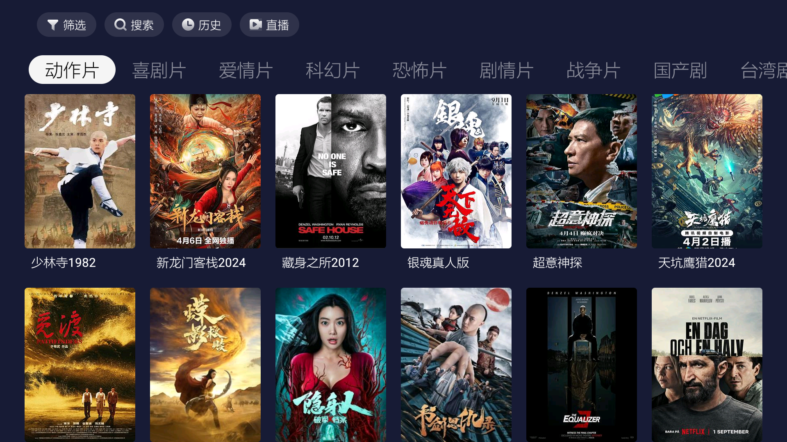
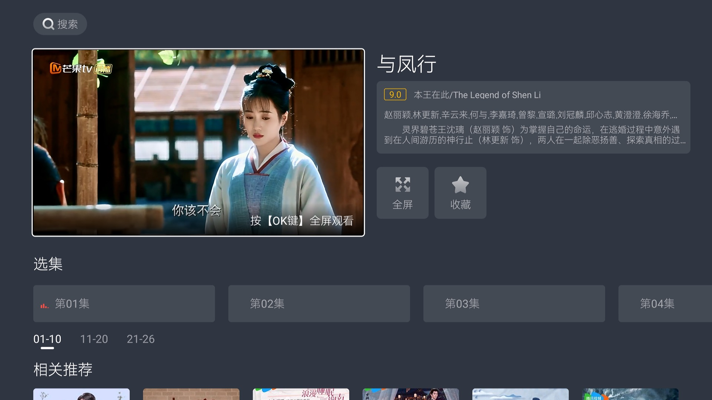
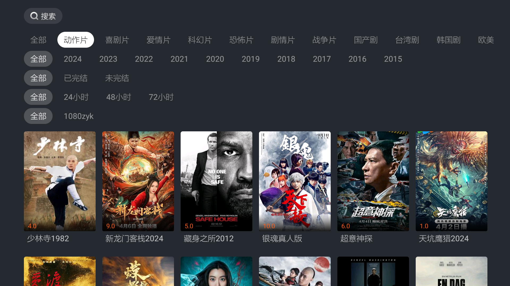
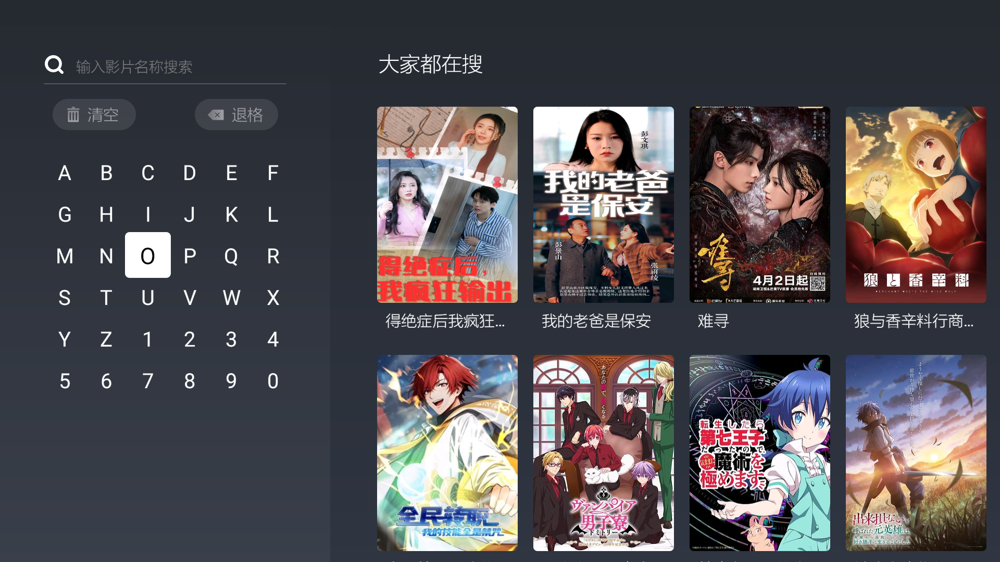
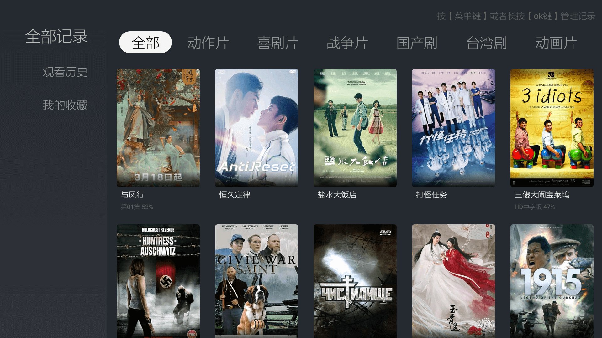
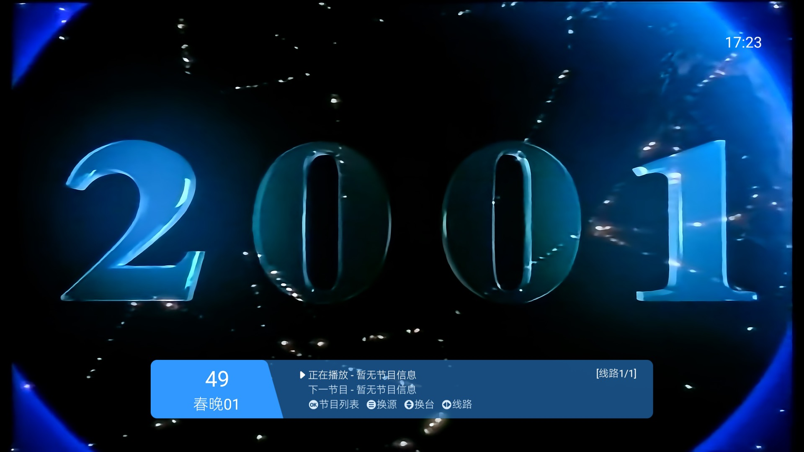
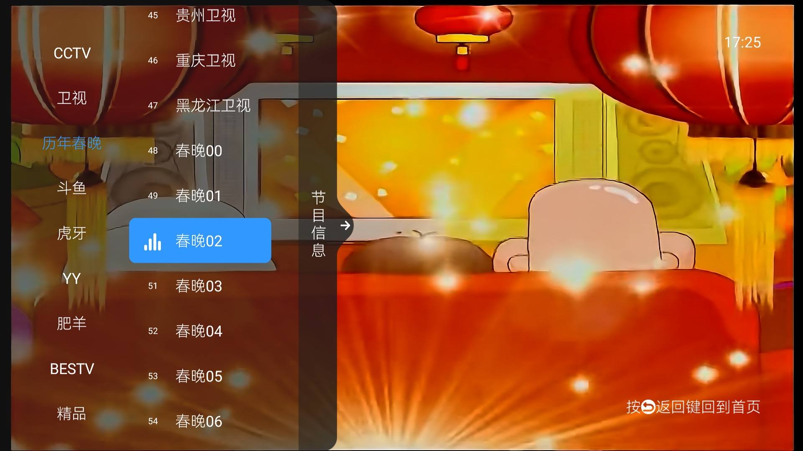

# HelloTV-Case 
[](https://opensource.org/licenses/apache-2-0)
[](https://github.com/vuejs/core)
[](https://www.npmjs.com/package/@quicktvui/quicktvui3?activeTab=versions)

**免责声明：本项目不内置任何数据，请在符合当地法律的前提下学习使用。**

基于 [HelloTv](https://github.com/quicktvui/hellotv) 专为快速打造安卓TV影视应用而开发的示例项目。项目主要目的是让开发者通过对本项目的简单修改，实现一些TV端常见的功能页面，从而加速开发者开发TV类影视类应用。

* 首页

* 详情页

* 筛选页

* 搜索页

* 历史页

* 直播页

* 频道页

* 换源页


> 目前项目仅供参考，代码逐步完善中，请暂勿用于正式项目中。
> release版本会于近期推出，敬请期待！

## 脱壳反编译

### 1. 使用 mt管理器

* 安装[MT管理器](https://mt2.cn/download/)
* 反编译修改[教程](./doc/mt.mp4)

### 2. 使用 apktool

> 选择对应平台安装工具，[官方文档](https://apktool.org/docs/install)

```bash
# 解包
~ apktool d HelloTV壳_1.0.0_20240511101523_release.apk

# 修改配置文件, 配置文件优先级：远程 > 本地 > 默认
~ cat HelloTV壳_1.0.0_20240511101523_release/assets/config.json
{
    "config": {
        "local": {   // 从本地读取配置
            "name": "",
            "icon": "",
            "zhibo": "",  // 直播默认源
            "dianbo": ""  // 点播默认源
        },
        "remote": "" // 从远程读取配置文件，文件格式 {"name": "", "icon": "", "zhibo": "", "dianbo": ""}
    },
    "version": 1,
    "load_type": 3,
    "rpk_package": "es.hellotv",
    "rpk_load_uri": "https://extcdn.hsrc.tv/data_center/files/plugin/2024/04/18/b83e970b-deae-4db8-87e1-cec82531acab.zip",  // 从远程加载快应用代码包
    "repo": ""
}

# 修改APK图标, 替换下面图标文件, 注意：文件名必须为 ic_launcher.png
~ res/mipmap/ic_launcher.png

# 封包
~ apktool b HelloTV壳_1.0.0_20240511101523_release

# 生成证书
~ keytool -genkey -alias abc.keystore -keyalg RSA -validity 20000 -keystore abc.keystore

# 使用证书签名
~ jarsigner -verbose -keystore abc.keystore -signedjar helloTvCase.apk HelloTV壳_1.0.0_20240511101523_release/dist/HelloTV壳_1.0.0_20240511101523_release.apk abc.keystore
```

> 最后安装当前目录下生成的 `helloTvCase.apk` 即可。

## 源码修改

接入网络数据的准备工作请查看[PROJECT-README.md](PROJECT-README.md)
通过对每个页面提供的接口进行数据替换，即可实现自己的业务逻辑。

如有定制样式需求，可自行修改页面里样式文件。

具体可查看[/src/pages](./src/pages)目录下对应README说明。

### 调试

#### 1. 确认编译环境
建议windows:
- node version 16.20.2
- npm version 8.10

#### 2. 安装运行Runtime
下载并安装 [运行环境](http://v3.quicktvui.com/zh/resource/runtime.html) (需要日志时使用debug包，否则使用release)</b>

#### 3. 安装依赖
进入项目录下
```bash
npm install --legacy-peer-deps
```
#### 4. 编译调试
```bash
npm run dev
```
#### 5. 打开运行Runtime apk，查看效果
点击下图加载测试代码

>> 注意这里电脑调试地址要改成你电脑本机ip
```bash
adb shell am broadcast -a  com.extscreen.runtime.ACTION_CHANGE_DEBUG_SERVER --es ip 192.168.xx.xx(电脑IP地址)
```
关于adb等其它配置具体说明请查看 <u>[安装和环境配置]([http://developer.extscreen.com/guide/](http://v3.quicktvui.com/zh/guide/installation.html)) </u>

最后看到加载出页面，表示完成调试，即可随时修改源码查看效果。

#### 6. 打包生成APK

[APK配置](android/README.md)

``` bash
# 生成debug包
npm run build-apk-debug
# 生成release包
npm run build-apk-release
```
打包完成后apk在 `./android/app/build/outputs/apk/` 文件夹下

#### 7. 修改默认源

* 点播源，支持苹果CMS `src/build/BuildConfig.ts -> requestBaseUrl`
* 直播源，支持tvbox `src/build/BuildConfig.ts -> defaultSourceUrl`

## 关于QuickTVUI
QuickTVUI是基于[Hippy](https://github.com/Tencent/Hippy)框架实现的TV快应用开发框架，旨在解决大屏开发困难、更新困难等疑难问题。  
它具有以下特征：
- 开发便捷：内置了大量针对智能电视开发的UI组件，简单易用;
- 快速更新：利用前端生态，实现免下载、免安装，方便快速迭代；
- 接近原生的体验：采用react-native的形式,底层用native实现，保证接近原生的体验;
- 全面兼容：已适配市面上大部分型号的智能电视、盒子、智能投影等，可免除开发者大量的适配工作;

<!-- ## 文档 -->
<!-- 查看完整的文档和示例，请访问[quicktvUI](http://quicktvui.com/)文档。 -->

## 贡献
我们欢迎并鼓励贡献，您可以通过以下方式参与：
- 提交错误报告或功能请求
- 提交拉取请求
<!-- 请阅读[贡献指南](CONTRIBUTING.md)获取更多信息。 -->
## 许可证
该项目基于Apache2.0许可证。请查阅 [LICENSE](https://opensource.org/licenses/apache-2-0) 文件以获取更多信息。

## 支持

如果您有任何问题或疑问，请通过以下方式联系我们：

- 邮箱：zhaopeng1@huan.tv
