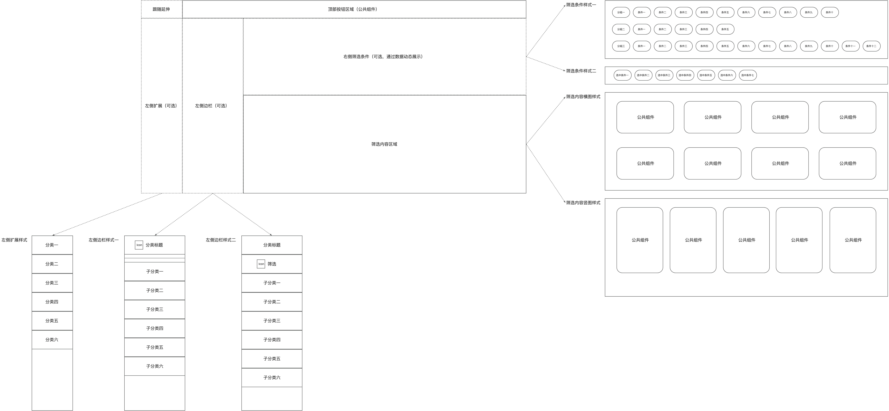

# 筛选

## 页面功能

    页面支持三种布局方式，通过页面级配置文件config.ts中layoutMode来控制。

    layoutMode: 1 # 单栏布局，基础单页面
                2 # 两栏布局，左侧筛选项列表、右侧基础单页面
                3 # 三栏布局，在两栏布局的基础上增加了扩展一级筛选项列表

## 页面布局



### 基础单页面（single-contents.vue）


### 左侧筛选项列表、右侧基础单页面（sidebar-contents.vue）


### 左侧筛选项列表(支持向左扩展一级筛选项列表)、右侧基础单页面（expand-sidebar-contents.vue）


## 目录结构

```bash
src/pages/filter
├── README.md                               // 自述文件
├── adapter                                 // 数据转换及类型定义
│   ├── index.ts
│   └── interface.ts
├── api                                     // 网络请求
│   ├── index.ts
│   ├── interface.ts
│   └── request-url.ts
├── components                              // 页面组件
│   ├── content                             // 筛选内容
│   │   ├── grid-item-h.vue
│   │   ├── grid-item-v.vue
│   │   ├── index.vue
│   │   ├── list-item-record.vue
│   │   └── list-item.vue
│   ├── expand                              // 左侧列表扩展
│   │   └── index.vue
│   └── sidebar                             // 左侧列表
│       ├── index.vue
│       ├── list-item-filter-title.vue
│       ├── list-item-filter.vue
│       ├── list-item-line.vue
│       ├── list-item-text.vue
│       └── list-item-title.vue
├── scss                                    // 样式文件
│   ├── filter-content-grid-item.scss
│   ├── filter-content-list-item.scss
│   ├── filter-content.scss
│   ├── filter-expand.scss
│   ├── filter-sidebar.scss
│   └── filter.scss
├── config.ts                               // 页面配置
├── expand-sidebar-contents.vue
├── sidebar-contents.vue
└── single-contents.vue
```
